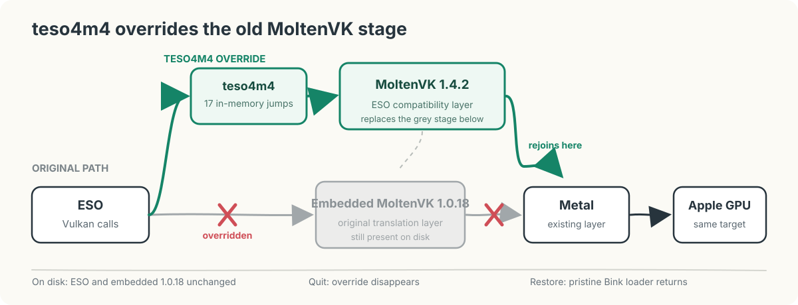
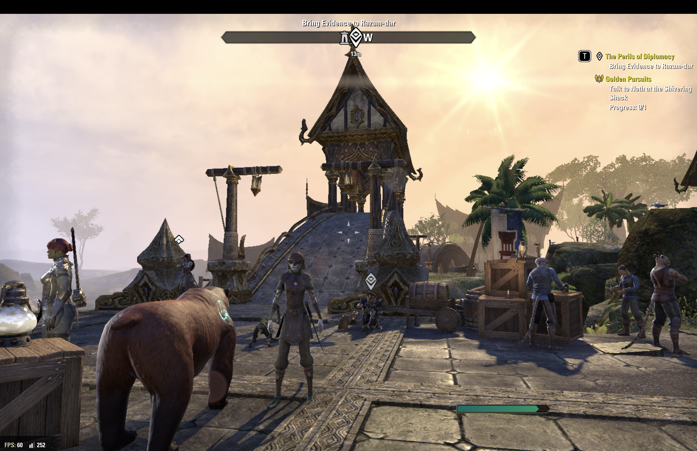

# ESO MoltenVK Patcher

**ESO MoltenVK Patcher** redirects the macOS client of **The Elder Scrolls
Online** from its
statically embedded MoltenVK 1.0.18 runtime to the current official MoltenVK
1.4.2 release. The current patch and installer are validated on the normal
Steam launch path; on the tested M4 MacBook Air, a 2048 x 1280 medium-to-high
graphics profile held the 60 FPS VSync ceiling throughout roughly 93 minutes
of user-observed active gameplay.

[](https://github.com/meringue5/eso-moltenvk-patcher/releases/latest)

## How to install

The public release is a prebuilt ZIP. Players do **not** need Python, Xcode, or
a source checkout.

1. [Download the latest GitHub Release](https://github.com/meringue5/eso-moltenvk-patcher/releases/latest)
   and choose `ESO-MoltenVK-Patcher-<version>.zip` under **Assets**.
2. Unzip it and open the single **ESO MoltenVK Patcher** folder.
3. Quit ESO and the ZeniMax launcher. Steam may remain open unless it is
   updating or using ESO's files.
4. Double-click `Install.command`. Review the detected ESO path and type `y`
   only when it is correct. When asked about the validated M4 2048×1280
   settings template, explicitly enter `y` or `n`; there is no default.
5. Start ESO later through your normal Steam or official ESO launcher.

The installer checks known Steam and ZeniMax locations. If it cannot find the
game, it asks you to drag `eso.app` or `ESO Launcher.app` into Terminal. It
verifies the exact supported client and a restorable backup before changing
anything. Double-click `Uninstall.command` to uninstall and restore the
original. Payloads, checksums, and optional support diagnostics live in a
Finder-hidden internal folder rather than cluttering the player-facing view.

Install and Uninstall use a dependency-free terminal stepper: each completed
verification or change is shown as a numbered stage, followed by a concise
target, version, settings, and recovery summary. Interactive terminals use
light color; redirected logs remain plain text. Technical failures state
whether mutation started and how verified recovery proceeds.
The interactive view clears the shell's launch command from the visible
viewport, shows the complete plan in muted text, and promotes each finished
stage to a bright green checked row.
Target confirmation and settings use no default selection: move with the Up
and Down arrows and press Return, or use Y/N shortcuts. Return does nothing
until a choice is highlighted; Escape cancels.

Choosing settings application selectively merges 48 allowlisted keys after
backing up `UserSettings.txt`; it does not replace the complete file. Removal
restores that backup only when the settings have not subsequently changed.

See the [illustrated installation guide](docs/INSTALL.md) for the complete
walkthrough, macOS **Open Anyway** instructions, recovery behavior, and common
failure messages.

## What the patch delivers

[](docs/images/teso4m4-runtime-hijack-simple.svg)

*The grey line is ESO's original path through embedded MoltenVK 1.0.18. At
launch, ESO MoltenVK Patcher cuts that route at the old entry points, takes the green
detour through MoltenVK 1.4.2, and rejoins the same Metal stage. The grey code
remains unchanged on disk, and the override disappears when ESO exits.*

- **60 FPS in real gameplay on the validated M4 checkpoint.** The previous
  sustained 30--33 FPS degradation did not return during the 93-minute session.
- **Higher visual settings without the old performance compromise.** The
  validated profile enables SSAO, high-resolution shadows, higher character
  detail, foliage, water reflections, and full-resolution subsampling.
- **Stable live graphics changes.** Resolution and graphics-setting changes
  returned to correct scene rendering instead of crashing or leaving a solid,
  black, or frozen frame.
- **A current Metal translation layer.** ESO runs through official MoltenVK
  1.4.2 with a compatibility and performance profile designed for its legacy
  Vulkan behavior.
- **The normal Steam path stays intact.** Launch and authentication continue
  through Steam; the patch does not replace the launcher or bypass login.
- **Updates fail safely and restoration is built in.** Unknown ESO builds are
  rejected, original files and caches are preserved, and a checked restore
  path is included.

## See it running

[](docs/images/teso4m4-m4-gameplay-60fps.png)

*User-controlled gameplay during the validated roughly 93-minute session. The
scene contains multiple characters, props, architecture, foliage, shadows, and
distance detail; the lower-left HUD shows the 60 FPS VSync ceiling. Click the
image to inspect the original 3420 x 2214 screenshot.*

## Before and after

| Embedded MoltenVK 1.0.18 | ESO MoltenVK Patcher with official MoltenVK 1.4.2 |
|---|---|
| Medium settings were not practical in long-term user experience | Validated 2048 x 1280 medium-to-high profile |
| Minimum-oriented play often stayed below 50 FPS | Active gameplay held the user-observed 60 FPS VSync ceiling |
| Object-heavy states repeatedly approached 30--33 FPS | No comparable sustained degradation during roughly 93 minutes across multiple zones |
| Leaving or reloading the current UI/world state was used as a recovery workaround | Performance remained stable through ordinary play and zone changes |
| Graphics changes could destabilize or crash the client | Six logged graphics-device resets completed with correct rendering afterward |

Preserved Metal HUD captures independently measured the embedded-runtime state
falling from 54--56 FPS to 33.80 FPS while thermals remained nominal. The
current 60 FPS result is the user's observation of the on-screen counter. The
preserved logs independently establish the session duration, repeated world
loads, exact bridge configuration, six graphics-device resets, and absence of
a subsequent crash report. See the
[frame-rate findings](docs/FINDINGS.md#repeatable-frame-rate-degradation) and
[MoltenVK 1.4.2 validation](docs/experiments/0021-moltenvk-1.4.2-maintenance.md).

## Why ESO needs a bridge

ESO does not load MoltenVK from a replaceable dynamic library. MoltenVK 1.0.18
is statically linked into the game executable, so swapping the bundled
framework or archive does not change the code that runs.

ESO MoltenVK Patcher solves that boundary by:

1. loading through ESO's existing Bink dynamic-library path while re-exporting
   the complete original Bink interface;
2. verifying the exact ESO SHA-256, Mach-O UUID, and original patch-site bytes;
3. loading the pinned official MoltenVK 1.4.2 dynamic library;
4. redirecting all 17 verified externally referenced Vulkan entry points in
   the running process;
5. applying narrow HDR, surface-format, descriptor, and runtime-configuration
   compatibility behavior required by ESO; and
6. restoring executable code pages to RX permissions after patching.

ESO's executable is not rewritten on disk. Unknown builds and unexpected bytes
stop before redirection rather than receiving a best-effort patch. The detailed
design is documented in [Bridge architecture](docs/ARCHITECTURE.md). The
[detailed runtime hijack diagram](docs/images/teso4m4-runtime-bridge.svg) shows
the reversible Bink loader setup, validation transaction, private code-page
copies, 12-byte jumps, and restore path.

## All macOS editions and release direction

**The stale runtime belongs to the ESO macOS game client; it is not evidence of
a separate, abandoned Steam-only renderer.** ESO switched its Mac renderer to
MoltenVK in [Update 20 in October 2018](https://forums.elderscrollsonline.com/en/discussion/comment/5552032/),
and the current ESO 12.0.7 Mac executable under test still contains MoltenVK
1.0.18, an [August 2018 release](https://github.com/KhronosGroup/MoltenVK/blob/main/Docs/Whats_New.md#moltenvk-1018).
The game client has continued to update; its embedded translation layer has
not kept pace with those updates.

Steam supplies the entry point and authentication, then opens the ZeniMax ESO
launcher, which maintains the Mac player client and shared game-content
repositories. ZeniMax's own
[support procedure](https://help.elderscrollsonline.com/app/answers/detail/a_id/26040/~/what-do-i-do-if-i-click-play-and-nothing-happens-on-steam-when-playing-on-mac)
even moves a Steam-installed ESO game folder into a website-launcher
installation before resuming updates. This supports a shared Mac client
lineage, not an intentionally frozen Steam branch.

The distinction for this repository is operational:

- **Technical target:** the exact ESO macOS `eso.app` and its statically linked
  MoltenVK runtime.
- **Observed production path:** Steam macOS installation, exact ESO 12.0.7
  target, and normal Steam-authenticated launch used for gameplay evidence.
- **Release eligibility:** Steam and direct website-launcher installations are
  handled identically when the selected `eso.app` matches an exact supported
  profile and passes the same layout, backup, and bundle-idle checks. An
  unknown client fails closed; a direct-path gameplay run remains additional
  compatibility evidence, not an installation prerequisite for an identical
  executable.

See the [macOS client scope review](docs/research/eso-macos-client-scope.md) for
the source record and limits of that conclusion.

### Public release package

ESO MoltenVK Patcher is **not** an ESO add-on. It cannot be installed in the game's
`AddOns` folder because it changes the runtime path inside the macOS game
client. A folder-copy add-on release would therefore be misleading and would
not work.

The initial release package is a GitHub Release ZIP containing prebuilt bridge
payloads and one-step **Install** and **Remove** command scripts, plus optional
**Status** diagnostics. It is an
installation tool, not an app that must stay running while ESO is played. It bundles the
verified bridge and runtime so players do not need Python, Xcode, or build
scripts. A signed **ESO MoltenVK Patcher.app** DMG remains the future polished
distribution option.

The installer is edition-neutral:

1. look for the known Steam and official ZeniMax launcher locations, then let
   the player choose an ESO or launcher app if it is elsewhere;
2. identify the contained `eso.app`, rather than trusting its enclosing path;
3. verify the executable identity, static layout, required companion files,
   and original patch bytes against a supported profile before changing
   anything;
4. make and record a restorable backup for that exact installation; and
5. leave launching and authentication to the player's usual Steam or official
   ESO launcher path.

An unknown client build must stop safely rather than receive a best-effort
patch. The release installer requires ESO and its launcher to be closed before
it changes their files, but
Steam itself should not be treated as a required installation dependency or be
asked to quit unless it is actually blocking access to the selected game files.

The repository can assemble an ad-hoc-signed development DMG. Publication
still requires a Developer ID signature, notarization, and a clean-machine
Gatekeeper check; see [Release packaging](docs/RELEASE.md).

## Production baseline

ESO MoltenVK Patcher was promoted from research to a production runtime patch on
2026-08-01. The exact supported scope, promotion boundary, and remaining
limitations are recorded in [Production baseline](docs/PRODUCTION.md).

| Component | Verified value |
|---|---|
| Mac | Apple M4 MacBook Air |
| ESO | Steam macOS client 12.0.7, databuild `3281538` |
| Replacement runtime | Official MoltenVK 1.4.2 |
| Bridge profile | `performance-aggressive` plus the bounded startup compositor neutralizer |
| Display profile | 2048 x 1280, VSync enabled |
| Graphics profile | Mixed medium-to-high settings with SSAO and high-resolution shadows |
| Ordinary-play validation | Roughly 93 minutes across multiple zones |
| Observed active-gameplay frame rate | 60 FPS VSync ceiling |
| Graphics-device resets | Six complete sequences, zero logged reset errors |
| Crash result | No subsequent ESO crash report |

The 48 allowlisted settings are available as the
[M4/MoltenVK 1.4.2 standard profile](config/usersettings-m4-moltenvk-1.4.2-standard.txt).
It is a selective merge reference, not a complete `UserSettings.txt`
replacement.

The current bridge is deliberately exact-build software. A launcher update is
accepted only after its executable identity and static layout pass the update
gate. The tested result applies to the combined runtime, bridge profile,
settings, and cache checkpoint on the listed M4; other Apple GPUs and ESO
builds require their own validation.

The former full-screen hot-pink startup interval is now neutralized by replacing
only the exact bounded placeholder-compositor draws with the existing black
startup background. Two consecutive exact runs passed and forwarded the normal
scene unchanged. The underlying ESO placeholder input is not modified; release
packaging and diagnostic-log reduction for the proven runtime guard are tracked
in the [current project status](docs/STATUS.md).

## Source build and maintenance installation

The following path is for contributors and production maintenance, not for the
future end-user release installer. It currently requires macOS, Xcode
command-line tools, Python 3, and the validated Steam installation of ESO. No
ESO executable, Bink binary, credentials, or cache is distributed by this
repository.

Fetch the pinned official MoltenVK release and build the bridge:

```sh
./scripts/fetch-moltenvk.sh
./scripts/build.sh
```

Check the installed ESO build before installation:

```sh
./scripts/quick-update-check.sh
```

`READY` is the routine path. `STOP` means the client, launcher state, or bridge
checkpoint needs review before installation.

Install or restore the validated bridge:

```sh
TESO4M4_EXPERIMENTAL=I_ACCEPT_CRASH_RISK ./scripts/install.sh
./scripts/restore.sh
```

The explicit environment gate prevents an accidental game-bundle change; it
does not replace the exact-build, source-build, original-file, and restore-path
checks performed by the installer.

When a new ESO build retains the verified binary layout,
`scripts/rebase-update.sh` can audit and create a new target manifest without
modifying the game bundle. See the [update runbook](docs/UPDATES.md).

## Documentation

- [Installation guide](docs/INSTALL.md)
- [Project naming and compatibility](docs/NAMING.md)
- [Current verified status](docs/STATUS.md)
- [Durable findings](docs/FINDINGS.md)
- [Bridge architecture](docs/ARCHITECTURE.md)
- [Release packaging](docs/RELEASE.md)
- [Production logging policy](docs/LOGGING.md)
- [Experiment history](docs/experiments/README.md)
- [Settings and operational guidance](docs/SETTINGS.md)
- [Documentation guide](docs/README.md)

## Repository layout

```text
config/             Build fingerprints and non-personal settings snapshots
docs/               Current status, findings, plans, and technical guidance
docs/experiments/   Append-only experiment records and evidence summaries
docs/research/      Dated external precedent and literature reviews
scripts/            Fetch, build, install, restore, and status helpers
src/                Runtime bridge source
tools/              Binary-analysis and compatibility probes
```

## Scope and license

ESO MoltenVK Patcher is unaffiliated with ZeniMax, Bethesda, Valve, Apple, or Khronos. The
project is MIT-licensed and does not distribute proprietary game files,
credentials, or caches. MoltenVK is fetched from its official release and
remains under its Apache 2.0 license. Use this project only with software and
accounts you are authorized to operate.

## 한국어 요약

**ESO MoltenVK Patcher**는 ESO의 macOS 실행 파일에 정적으로 포함된 MoltenVK 1.0.18을
공식 MoltenVK 1.4.2로 우회하는 비공식 런타임 패치입니다. 구형 런타임은
Steam 전용 앱의 문제가 아니라 현재 ESO macOS 클라이언트에 포함된
구성요소이며, 현재 배포본과 설치 절차는 Steam판의 정상 인증 경로에서
검증됐습니다. 테스트한 M4 MacBook Air에서는 과거 낮은 설정에서도 50 FPS
유지가 어려웠고
오브젝트가 많아지면 약 30--33 FPS까지 반복적으로 하락했지만, 패치 적용 후
2048 x 1280의 중간 이상 혼합 설정으로 약 93분간 여러 지역을 플레이하면서
사용자가 확인한 실제 플레이 구간은 VSync 상한인 60 FPS를 유지했습니다.
여섯 번의 그래픽 장치 재설정과 설정·해상도 변경도 크래시나 지속적인
렌더링 손상 없이 완료됐습니다. 정확히 검증된 ESO 빌드에서만 작동하며,
Steam 실행과 인증 경로 및 원본 복구 경로를 그대로 보존합니다.

일반 사용자는 README 상단의 **Download Latest Release** 버튼에서 미리
빌드된 ZIP을 받아 `Install.command`를 한 번 실행하면 됩니다. Python이나
Xcode는 필요하지 않습니다. 설치기는 Steam판과 공식 런처판의 알려진
경로를 모두 찾고, 경로가 다르면 앱을 Terminal에 드래그하도록 안내하며,
정확히 검증된 클라이언트에만 설치합니다. `Uninstall.command`로 원본을
복구할 수 있습니다. ESO 애드온 폴더에 넣는 방식은 이 런타임 패치에
적합하지 않습니다. 자세한 화면별 절차는 [설치 가이드](docs/INSTALL.md)를
참고하세요.
