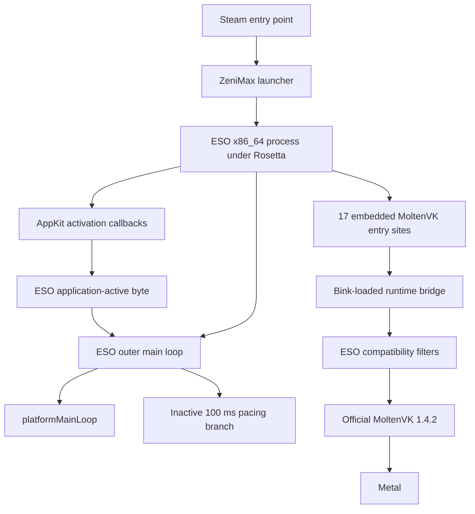

# ESO host runtime structure

This document owns the durable, build-specific structural analysis of ESO's
macOS host application around the MoltenVK bridge. It is not an ESO source-code
description or a stable vendor ABI. The exact offsets below apply only to the
fingerprinted 12.0.8 executable and must be re-established after a game update.

Run-specific observations and candidate outcomes remain in
[Experiment 0041](experiments/0041-inactive-pacing-bypass.md). The bridge's own
design is documented separately in [Architecture](ARCHITECTURE.md).

## Layer map



The inactive pacing branch is in ESO's host application loop, above and
outside the Vulkan-to-Metal translation path. The pink startup placeholder is
produced inside the rendering path. They can therefore appear together without
being the same mechanism.

## Exact analyzed build

| Property | Value |
|---|---|
| Client | ESO 12.0.8 |
| Databuild | `3288357` |
| SHA-256 | `a819aa2313e91676bdfa3987ae650d594a86faf2429ad56c736b5e6992680609` |
| Mach-O UUID | `0e6ea0ca-cac2-37c4-9834-cac2b8467950` |
| Architecture | x86_64, executed through Rosetta on the validated Apple Silicon host |

All addresses below are unslid image offsets. Add them to the process image
base only after the executable identity and UUID pass. Analyst working names
such as `GameClient::mainLoop` describe recovered behavior; they are not a
claim that vendor source or symbols are available.

## Host outer loop

The exact control flow at image offset `0x30f2f` is equivalent to:

```text
while (client.running) {
    platformMainLoop(client)

    if (!client.running) {
        terminate_application()
    } else if (!application_active) {
        usleep(100000)
    }
}
```

Relevant locations are:

| Image offset | Structural role |
|---:|---|
| `0x30f2f` | outer-loop function entry |
| `0x30f62` | sends the `platformMainLoop` selector |
| `0x30f6b` | checks the client object's running byte at offset `+0x18` |
| `0x30f73` | reads the process-global application-active byte |
| `0x30f78` | begins the inactive pacing branch |
| `0x30f7a` | loads `100000` microseconds |
| `0x30f7f` | calls `usleep` |
| `0x30f84` | rejoins the common running-state path |
| `0x30f9e` | reloads the client running byte |
| `0x30fa1` | tests whether another iteration should begin |

The 12-byte patch-site fingerprint at `0x30f78` is:

```text
75 27 bf a0 86 01 00 e8 8a 78 8c 03
```

When the application-active byte is false, the fixed 0.1-second sleep limits
the outer-loop cadence to approximately 10 Hz before accounting for other
work. That is a direct structural match for the observed approximately-10-FPS
mode, but the disassembly alone does not prove that every observed low-FPS run
entered this branch. Runtime state evidence is required for that final link.

## Application activation state

The outer loop and the activation setter reference the same byte at image
offset `0x4a0c93c`.

Objective-C metadata maps the two callback names directly to their listed
implementation addresses; they are not names guessed solely from surrounding
instructions.

| Image offset | Behavior |
|---:|---|
| `0x31ed0` | activation callback entry; passes true to the setter |
| `0x31f22` | resignation callback entry; passes false to the setter |
| `0x164792` | compares and updates the application-active byte |
| `0x4a0c93c` | application-active byte read by the outer loop |

The setter writes only when the value changes. If its registered listener is
present, it forwards the new Boolean state through the listener's indirect
callback at vtable offset `0x28`. Experiment 0041 deliberately does not modify
either AppKit callback, the setter, the byte, or this downstream propagation.

ESO's background-FPS settings are a separate mechanism. The preserved
configuration selected a background limit of 60 FPS, whereas this branch uses
a literal 100,000-microsecond sleep. The fixed inactive path therefore explains
the 10-Hz signature more directly than the configurable background limiter.

## Relationship to the renderer and pink startup output

The recovered structure separates two axes:

| Axis | Location | Current interpretation |
|---|---|---|
| Host pacing | ESO AppKit outer loop | Can throttle all early 2D and later rendering work before MoltenVK pipeline creation becomes the useful boundary |
| Pink placeholder | ESO render/compositor path | Cosmetic startup output that can occur at either normal or low FPS |

This explains why a bad run can already look slow during the loading bar, well
before character selection and before ESO issues its normal bulk graphics-
pipeline wave. Pink remains evidence that rendering reached the placeholder
path; it is not evidence that the inactive pacing branch did or did not run.

Confirmed, inferred, and unresolved claims must remain distinct:

- **Confirmed:** the exact build contains the callbacks, shared active-state
  byte, and literal 100-ms inactive branch described above.
- **Inferred:** a stale or misordered activation state is the leading mechanism
  for the observed approximately-10-FPS startup class.
- **Unresolved:** the event ordering that could leave the internal byte false
  while the macOS window appears frontmost and focused.

## Experiment 0041 patch boundary

The installed source candidate replaces only the exact 12-byte inactive branch
with a same-size absolute call to a bridge hook. The hook observes the internal
active byte, logs the first state and at most 15 later transitions, and returns
without sleeping. Execution then rejoins at `0x30f84` and reloads the normal
client-running state.

The patch does not suppress pink, synthesize an activation event, force the
active byte true, alter AppKit callbacks, change cache state, or bypass the
normal launcher and authentication path. It retains the 0.1.2 MoltenVK profile
and adds only the host-loop pacing bypass and bounded state evidence.

The inactive site is committed in the same runtime code-page transaction as
the 17 Vulkan redirects. The exact executable identity, original 12 bytes,
destination, page boundary, writable transition, instruction-cache flush, and
RX restoration must all pass. The ESO executable remains unchanged on disk.

## Update and maintenance invariants

- Never copy these offsets to a different ESO executable, even if its version
  string is unchanged.
- Re-establish callback routes, the shared state reference, branch semantics,
  continuation behavior, and every patch-site byte for a new build.
- Keep the host-loop target separate from the relocation-tolerant MoltenVK
  compatibility fingerprint until an equally strict structural auditor exists
  for this path.
- An unknown executable or mismatched byte sequence must fail closed.
- Preserve the original loader and cache state before every install cycle.

## Evidence links

- [Experiment 0040: exact 0.1.2 low-FPS recurrence](experiments/0040-no-neutralizer-low-fps-recurrence.md)
- [Experiment 0041: inactive pacing bypass](experiments/0041-inactive-pacing-bypass.md)
- [Durable findings](FINDINGS.md#eso-has-a-separate-hard-coded-inactive-10-fps-outer-loop-path)
- [Exact target manifest](../config/targets-eso-2026-08-11.json)
- [Inactive pacing implementation](../src/eso_inactive_pacing.c)

The build-local mapping was reproduced with `otool -ov` for Objective-C method
metadata and `otool -tvV` for instruction flow. Only the small structural facts
and fingerprints above are retained in the repository; the proprietary ESO
executable and full disassembly are not.
