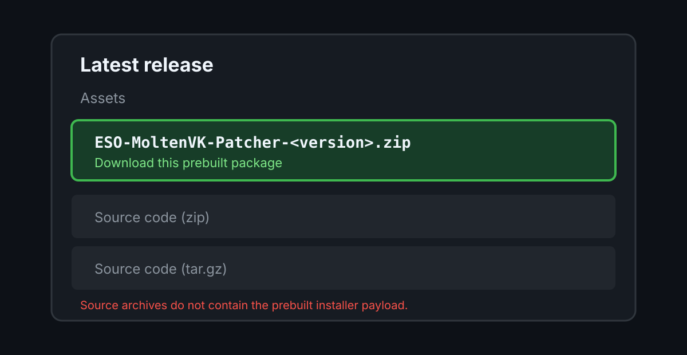
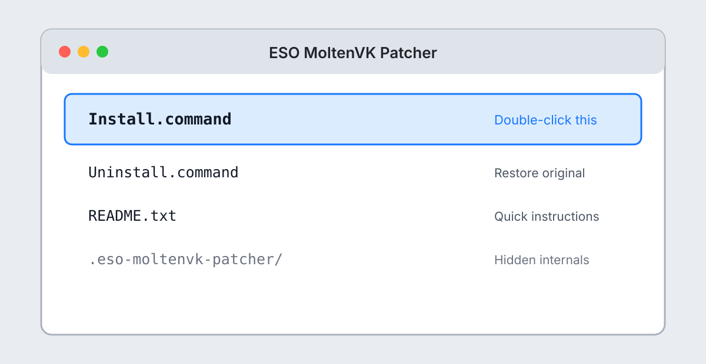
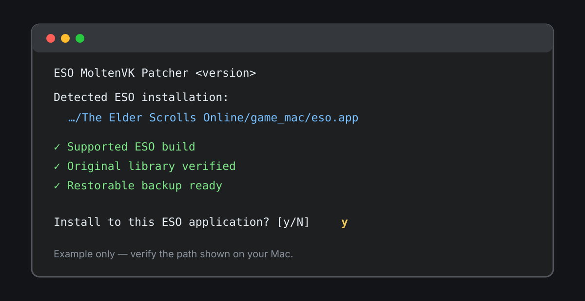
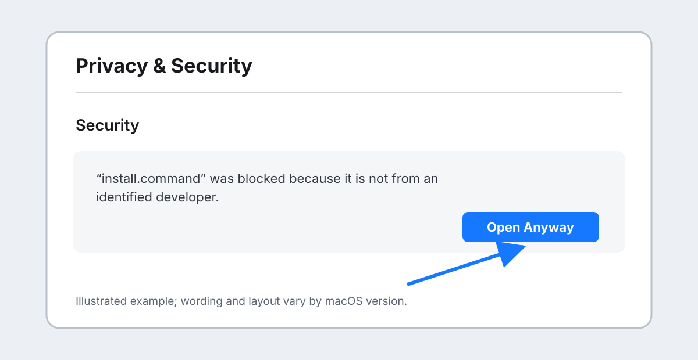

# Install ESO MoltenVK Patcher

This guide is for the prebuilt GitHub Release ZIP. It does not require Python,
Xcode, Homebrew, or a source checkout. The illustrations below intentionally
omit personal paths; the exact macOS wording and appearance can vary by
version.

## 1. Download and open the package

Open the [latest release](https://github.com/meringue5/eso-moltenvk-patcher/releases/latest),
expand **Assets** if necessary, and download
`ESO-MoltenVK-Patcher-<version>.zip`. Do not download GitHub's automatically
generated **Source code** archives: they are for contributors and do not
contain the prebuilt release payload.

Unzip the download. It opens as one folder containing three commands and its
payload. Finder normally shows only `Install.command`, `Uninstall.command`,
and `README.txt`; payloads, checksums, and support diagnostics remain in the
hidden `.eso-moltenvk-patcher` folder.

## 2. Quit the game, then run Install

Quit ESO and the ZeniMax launcher before installation. Steam itself may remain
open unless it is downloading, updating, or holding files in the selected ESO
bundle. Double-click `Install.command`.

Terminal presents six numbered stages covering discovery, exact-build
verification, idle checks, recovery preparation, bridge installation, settings,
and final verification. The progress display advances only when a real stage
finishes; it is not a time-based animation. The final summary lists the exact
ESO target, patcher version, settings choice, and backup result.
All stages are visible from the beginning. Pending rows are muted and have no
checkbox; completed rows become bright with a green checked box. The
interactive installer clears the shell's echoed launch command from the
visible viewport before drawing its header.
Confirmation menus initially highlight the first, affirmative choice: Install
for the detected target and Apply for the settings template. Use the Up and
Down arrows and press Return, or press Y/N directly. Escape cancels safely.

The installer searches known Steam and official ZeniMax locations. If ESO is
elsewhere, Terminal asks for a path: drag `eso.app` or `ESO Launcher.app` from
Finder into the Terminal window and press Return. This supports renamed,
moved, and non-Steam installations without guessing their locations.

Review the displayed target. Type `y` only when it names the ESO installation
you intend to patch. The installer then verifies the exact game build,
original library, payload checksums, idle state, and recoverable backup.

The installer also requires an explicit `y` or `n` response for the bundled
M4 2048×1280 settings template. Pressing Return alone does not choose a
default; the question repeats. Choosing `y` backs up `UserSettings.txt` and
selectively merges only the 48 allowlisted keys. Choosing `n` leaves all game
settings unchanged.

An exact supported ESO build is accepted directly. After a later launcher
update, the same installer may continue only when its bundled native auditor
proves that ESO's embedded MoltenVK and complete bridge-facing call structure
remain compatible. A changed runtime, patch byte, reference boundary, or proc
route stops without changing files. Do not work around that check.

## 3. If macOS blocks the command

An unsigned GitHub download may be blocked on first open. Try opening
`Install.command` once, then go to **System Settings → Privacy & Security**,
scroll to the Security section, and choose **Open Anyway** for the blocked
item. Confirm macOS's prompt, then run Install again.

The wording can differ by macOS version. Removing quarantine attributes with
`xattr` is not the normal installation path and is not recommended here.

## 4. Launch and uninstall

After a successful summary, close Terminal and start ESO through the same
Steam or official ESO launcher you normally use. The patcher does not replace
authentication and does not need to remain open.

Version 0.1.2 may show ESO's original full-screen pink placeholder during
startup. This is an accepted cosmetic limitation of the performance-first
profile and does not by itself mean installation failed. Use the included
Status command when the bridge identity needs verification.

To uninstall, quit ESO and the launcher and double-click `Uninstall.command`. It
verifies and restores the recorded original library. Keep the patcher folder
until removal is complete. Support diagnostics remain available inside the
hidden internal folder, but installation never requires a separate Check step.

If the settings template was applied, Remove restores the pre-install settings
only when the current file still exactly matches the applied result. If you
changed settings afterward, Remove preserves those changes and reports the
retained backup path instead of silently overwriting them.

If installation was interrupted, run `Install.command` again. It does not
blindly continue copying from the last line: it verifies the journal and
backup, restores a clean baseline, and restarts the transaction safely.

After the ESO launcher updates or repairs the game, quit ESO and the launcher
and run the same `Install.command` again. It recognizes both cases: the launcher
may restore the original loader, or it may leave the prior bridge installed
with a stale executable attestation. The installer preserves the verified
recovery record and reinstalls only after the updated executable passes its
compatibility audit.

For technical release details and supported-build policy, see
[Release packaging](RELEASE.md) and [Production baseline](PRODUCTION.md).
